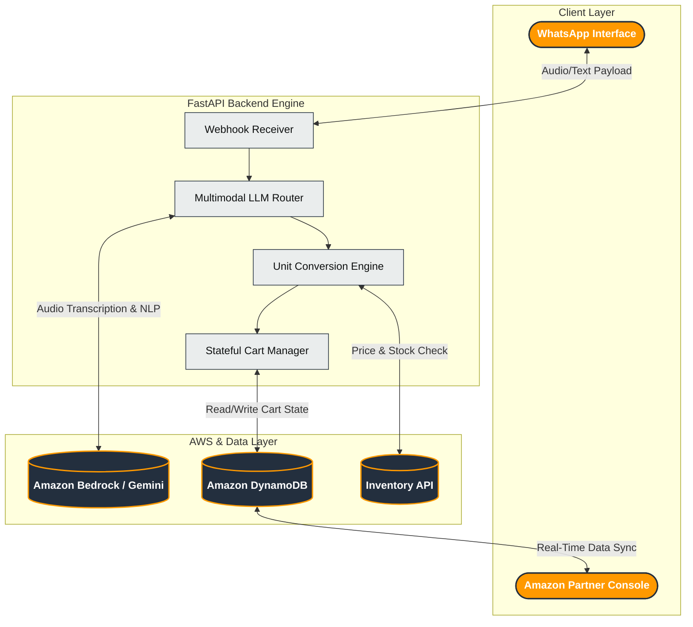

# 🛒 Amazon Now: Zero-UI Commerce for the Next Billion Users


**Amazon Now** is a multimodal, conversational quick-commerce architecture designed to eradicate the friction of traditional GUI-based shopping. Built for the *HackOn with Amazon* hackathon, it replaces search bars and complex navigation with a zero-learning-curve WhatsApp interface powered by LLMs. 

Users can simply send a voice note or a Hinglish text message, and the system instantly translates their intent into a fully-priced, payment-ready Amazon cart.

---

## ✨ Core Features

* **🗣️ Multimodal Intent Extraction:** Bypasses manual search. Users send unstructured voice notes or Hinglish text (e.g., *"Bhaiya, 1 kilo aalu aur 250gm paneer bhej do"*), and the AI instantly generates an exact-match cart.
* **⚖️ Proprietary Unit Conversion Engine:** Mathematically normalizes mismatched metric weights. If a user asks for "250gm" but the catalog prices by the "kg", the engine dynamically recalculates the exact fractional cost in constant time.
* **🧠 Multi-Tiered Predictive Upselling:** Analyzes the active cart array to inject contextual "Chef's Tips". (e.g., Automatically suggesting *Paneer Masala* if *Paneer* is added, and falling back to *Biryani Masala* if the former is already present).
* **🛒 "My Usual" Memory Ledger:** Persistent DynamoDB state management allows users to instantly reload past orders with a single command.
* **📱 Bi-Directional Amazon Partner Dashboard:** A secure, React-styled Seller Central command console featuring real-time, tri-phase data aggregation (Active Carts → Dispatch Queue → Fulfilled Archives) and automated WhatsApp delivery tracking pings.

---

## 🏗️ Architecture



## 🚀 Getting Started

### Prerequisites

* Python 3.9+
* AWS Account (DynamoDB access)
* Meta Developer Account (WhatsApp Cloud API configuration)
* `ngrok` (for local webhook tunneling)

### 1. Clone the Repository

```bash
git clone [https://github.com/yourusername/amazon-now.git](https://github.com/yourusername/amazon-now.git)
cd amazon-now

```

### 2. Set Up Virtual Environment (macOS/Linux)

```bash
python3 -m venv venv
source venv/bin/activate
pip install -r requirements.txt

```

### 3. Environment Variables

Create a `.env` file in the root directory and populate it:

```env
AWS_REGION=ap-south-1
AWS_ACCESS_KEY_ID=your_access_key
AWS_SECRET_ACCESS_KEY=your_secret_key

WHATSAPP_TOKEN=your_meta_graph_api_token
WHATSAPP_PHONE_ID=your_test_phone_id
WHATSAPP_VERIFY_TOKEN=your_custom_verify_token

GEMINI_API_KEY=your_gemini_key
S3_BUCKET_NAME=your_audio_processing_bucket

```

### 4. Initialize the Database

Run the seeder script to create the DynamoDB tables and populate the massive grocery catalog:

```bash
python setup_db.py

```

*Note: Wait for the console to output `✅ New Catalog Table created!` and `🌱 Successfully seeded items.*`

### 5. Run the Application

Start the FastAPI server:

```bash
uvicorn app.main:app --reload

```

Expose your local server to the internet using `ngrok`:

```bash
ngrok http 8000

```

*Take the generated ngrok HTTPS URL and paste it into your Meta Developer Dashboard webhook settings (append `/webhook` to the URL).*

## 💻 Dashboard Access

The Amazon Partner Console is protected via HTTPBasic Auth to secure customer logistics data.

* **URL:** `http://127.0.0.1:8000/admin` (or via your ngrok link)
* **Username:** `admin`
* **Password:** `amazon2026`

## 🧪 Demo Mode / "Frictionless Bypass"

To ensure absolute reliability during live hackathon presentations, a "Frictionless Bypass" is implemented in the router.
Sending the keyword "masala" (e.g., *"thik h ek paneer masala bhi add krdo"*) will instantly intercept the LLM call, bypass network latency, and forcefully inject 1 packet of Everest Paneer Masala into the cart. This allows for a flawless demonstration of the Chef's Tip upsell feature.

## 📜 License

This project is licensed under the MIT License - see the LICENSE file for details.

```

```
